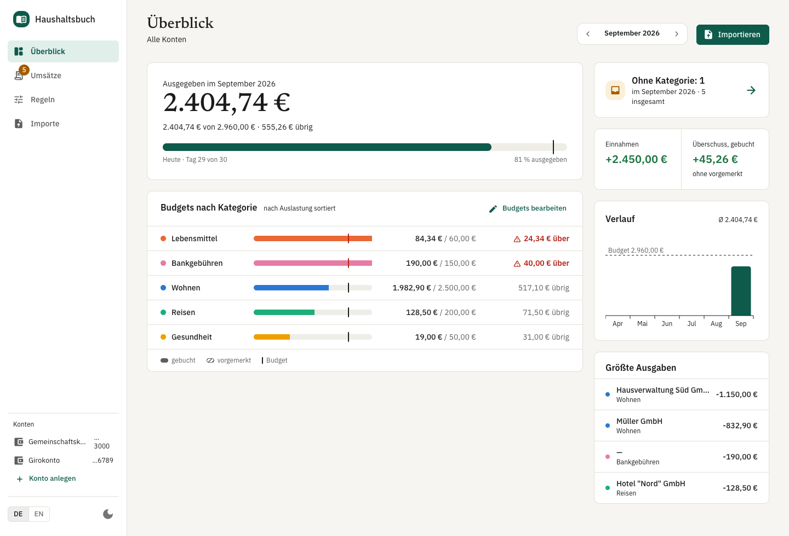
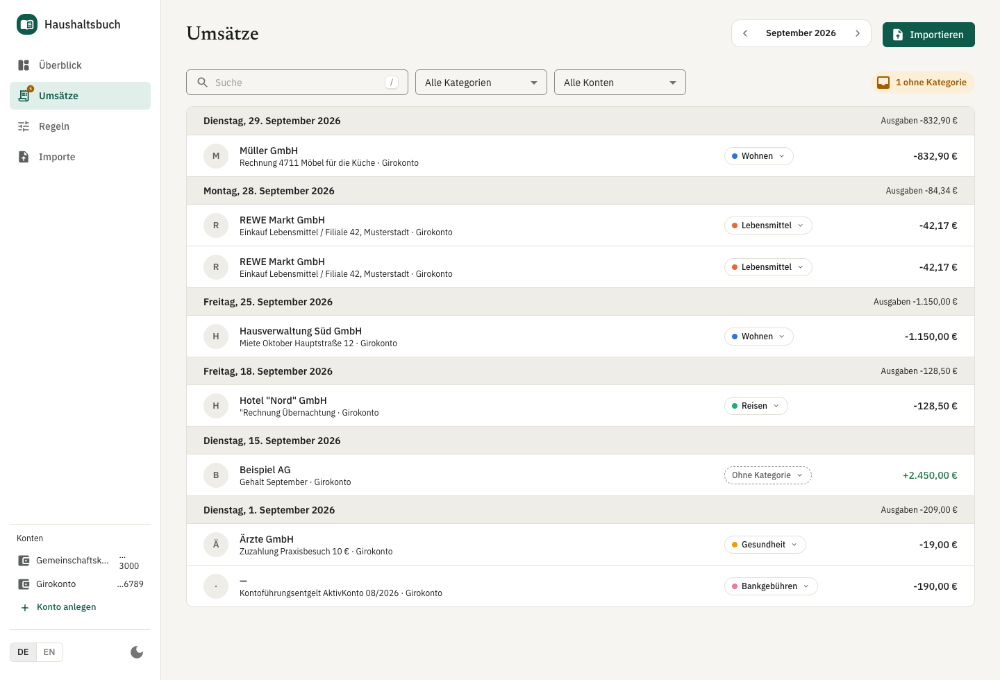
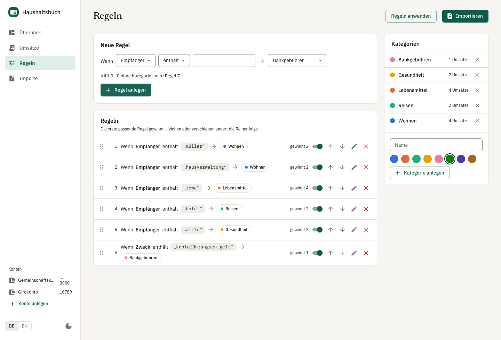
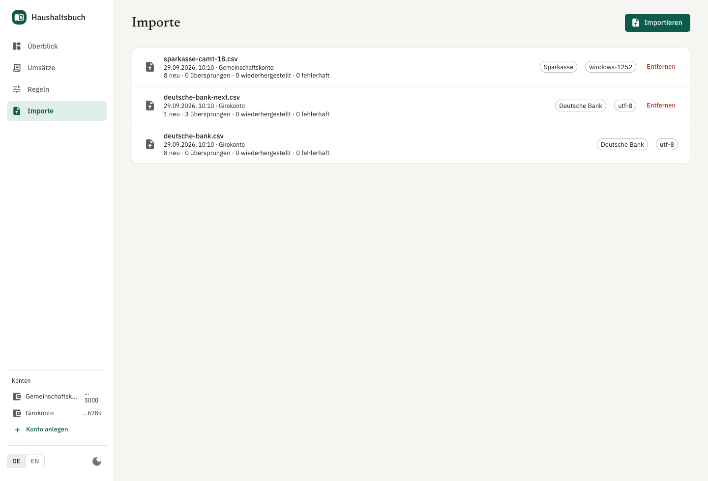

# household-budget

A local household budget app. It imports bank CSV exports, sorts each transaction into a
category by rules you write, and shows each month's spending per category against a limit.
One person's bank history, on their own machine, in SQLite — nothing is uploaded anywhere.



<sub>Screenshots show the synthetic data in `fixtures/`, never a real statement.</sub>

Built with Claude Code as the implementing agent, under a set of gates that make it prove
each change before it may call it done. How that works: [docs/best-practices.md](docs/best-practices.md).
How the code is cut and why: [docs/architecture.md](docs/architecture.md).

## What it does

1. **Import.** Upload a Sparkasse CSV-CAMT or Deutsche Bank export. The format is detected from
   the header, never asked. An overlapping export imports only what is new; a bad row is
   reported with its line number while the rest of the file imports. Every upload can be
   removed again, with undo.
2. **Categorize.** Write rules as sentences — `Wenn Empfänger enthält müller → Wohnen`. The first
   matching rule wins; a category set by hand is never overwritten by a rule.
3. **Report.** Each month: spend per category against its limit, what is still unsorted, and a
   six-month trend.

The UI is German, with an English switch and a light/dark theme.

## Setup

You need macOS or Linux with network access (`pnpm install` downloads Prisma's binaries from
`binaries.prisma.sh`).

1. **Node 24.** `nvm install` in the repo root reads `.nvmrc`.
2. **pnpm 12.** `corepack enable` — the exact version comes from `packageManager` in
   `package.json`.
3. **Install.** Clone the repository, then in its root:
   ```bash
   pnpm install
   ```
   This also generates the Prisma client and installs the git hooks.
4. **Configure the API.**
   ```bash
   cp apps/api/.env.example apps/api/.env
   ```
   The defaults work: the database at `apps/api/data/budget.db`, the API on port 3000.
5. **Create the database.**
   ```bash
   pnpm --filter @household-budget/api db:push
   ```
6. **Run it.**
   ```bash
   pnpm dev
   ```
   Open http://localhost:5173. The API listens on `127.0.0.1:3000` only; the web dev server
   proxies `/api` to it.
7. **Try it.** Create an account, then drop `fixtures/sparkasse-camt-18.csv` or
   `fixtures/deutsche-bank.csv` anywhere on the window (or press **Importieren**). Both are
   synthetic exports.

Only needed for some tasks:

- **Committing:** `brew install gitleaks`. The pre-commit hook fails rather than skips without it.
- **End-to-end tests:** `pnpm e2e:install` downloads the Chromium build Playwright uses.
- **After pulling a schema change** (`apps/api/prisma/schema.prisma`): run
  `pnpm --filter @household-budget/api prisma:generate`, then `db:push` again. `db:push` adds
  the new columns to your existing database without touching its rows.

CI runs steps 3–4 and the full check suite on a fresh Ubuntu runner for every PR.

## Checks

| Command          | What it runs                                                                                                         | Time    |
| ---------------- | -------------------------------------------------------------------------------------------------------------------- | ------- |
| `pnpm check`     | format → lint → architecture rules → unused code → duplicated code → typecheck → unit tests with coverage thresholds | ~20 s   |
| `pnpm check:all` | the above plus Playwright against a real API and browser — what CI runs                                              | minutes |
| `pnpm mutation`  | Stryker mutation tests over `packages/core` — CI runs it weekly                                                      | ~3 min  |

`pnpm check` prints one line per step and nothing else unless a step fails; then it prints that
step's output and stops.

Where each check runs:

| When                      | What                                                                                  |
| ------------------------- | ------------------------------------------------------------------------------------- |
| Agent edits a file        | Claude Code hooks: protected files, forbidden shell commands                          |
| Agent says it is done     | Claude Code Stop hook: `pnpm check`                                                   |
| `git commit`              | bank-data guard, gitleaks, Prettier and ESLint on staged files; commitlint            |
| `git push`                | architecture rules, unused code, duplicated code, typecheck, unit tests with coverage |
| Every PR (GitHub Actions) | all of the above, plus Playwright, gitleaks over history, `pnpm audit`                |
| Weekly                    | mutation tests                                                                        |

Narrower runs:

```bash
pnpm --filter @household-budget/api test
pnpm --filter @household-budget/api exec vitest run src/import/import.service.test.ts
pnpm --filter @household-budget/core exec vitest run -t 'parses both date widths'
```

Vitest has no root config; run it inside a package. `dev`, `test`, `typecheck` and `lint:deps`
build `packages/core` first — the apps consume its compiled `.d.ts`.

## Repo map

```
packages/core        Domain logic: CSV parsing, categorization rules, budget math.
                     Pure TypeScript, no framework. Both apps import its built dist/.
apps/api             NestJS REST API, SQLite via Prisma. Loopback only.
apps/web             React + Vite + MUI. The UI.
fixtures/            Synthetic bank CSVs, byte-exact as each bank ships them.
docs/research/       What was found out before building — CSV formats, UI, budgets.
docs/plans/          One plan per feature: the decisions, and where the build departed from them.
docs/reports/        Dated reviews and test sessions (dogfood, security).
docs/architecture.md Boundaries and data flow.
docs/best-practices.md  The agent workflow and its gates.
DESIGN.md            The UI rulebook.
CLAUDE.md            What the agent reads first; each package adds its own.
.claude/             Claude Code hooks (with tests) and project skills.
scripts/             check runner, bank-data guard, gitleaks wrapper, e2e database reset.
.github/workflows/   CI on every PR, mutation tests weekly.
lefthook.yml         Git hooks.
```

## Pages

- **Überblick** (`/`) — one month for the whole household: the booked total against the
  limits, a bar per category (vorgemerkt hatched, never added in; „über“ past the limit), what
  is still unsorted, a six-month trend. „Budgets bearbeiten“ turns the limits into fields.
- **Umsätze** (`/transactions`) — every transaction, grouped by day like a statement. Filter by
  account, category and a search over payee, purpose and IBAN. Each row's category is a pill
  that opens a searchable menu; choosing one by hand locks the row against rules. The chip on
  the right counts the month's booked rows with no category and shows them on click
  (`/inbox` is a shortcut to that filter).

  

- **Regeln** (`/rules`) — categories and rules. A rule's preview counts what it would reach
  before it is saved; drag, ↑/↓ or `Alt+↑`/`Alt+↓` reorders; _Regeln anwenden_ re-runs every
  rule over every account.

  

- **Importe** (`/imports`) — every upload, the ones that brought nothing new included. Removing
  one takes its rows out, with undo.

  

The month every page shows lives in the URL (`?m=2025-09`); the stepper in the top bar, or `[`
and `]`, moves it.

## License

[MIT](LICENSE).
