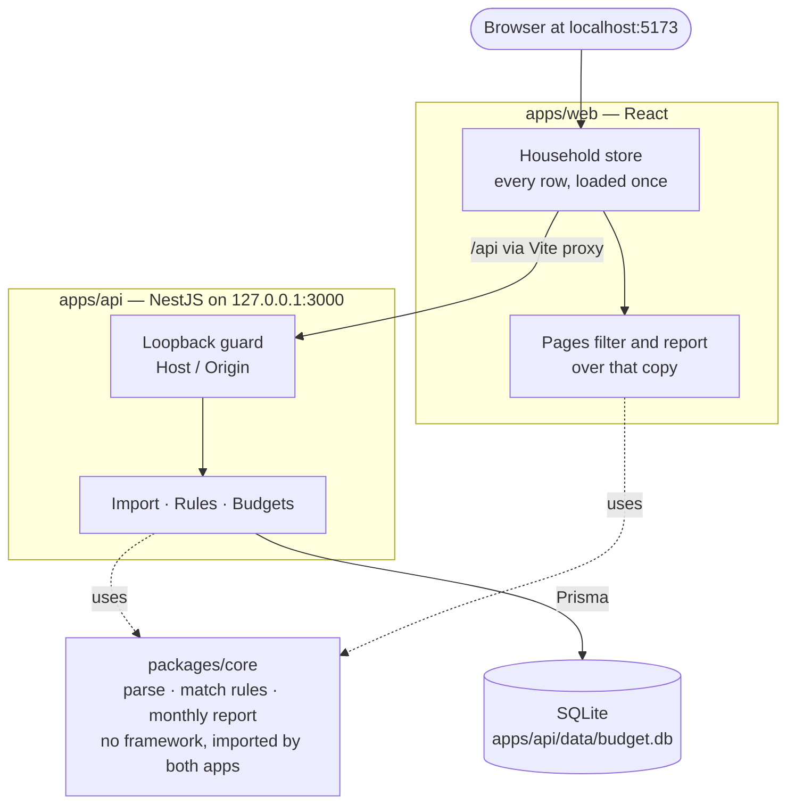
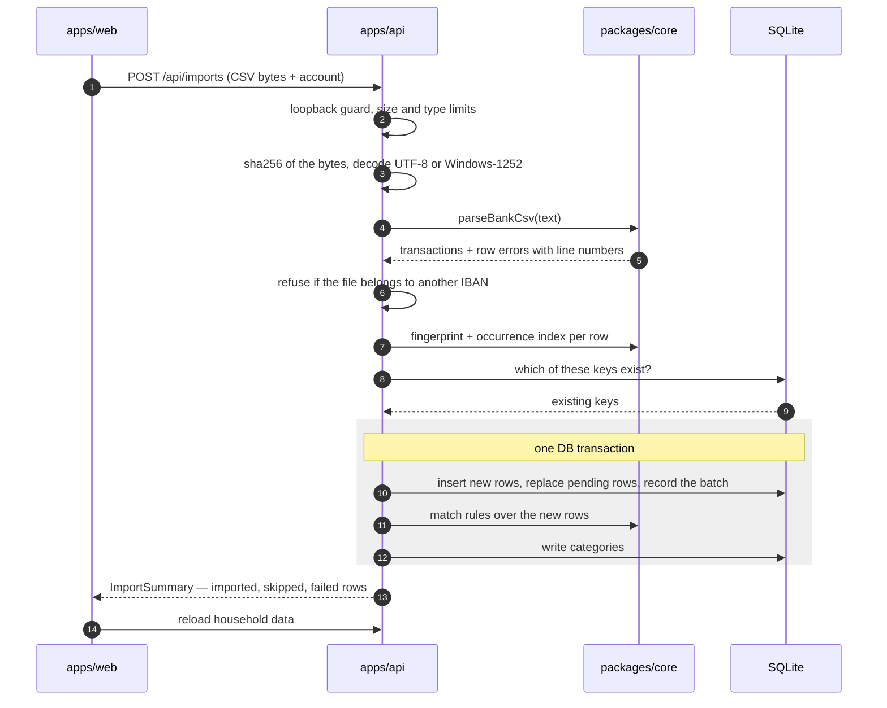

# Architecture

How the code is cut, what each boundary protects, and what enforces it. The decisions behind
each feature are in [docs/plans/](plans/); this page is the map across them.

## The constraint behind everything

This is **one person's bank history, on their own machine**. That rules out a server anyone
else can reach, and it makes a few choices deliberate rather than provisional:

- **SQLite**, not a placeholder for Postgres. One file, one user, no server to run.
- **No auth, no multi-tenancy.** The API only answers the machine it runs on (see
  [Security boundary](#security-boundary)).
- **One origin.** The Vite dev server proxies `/api` to the API, so the browser talks to one
  host and there is no API base URL to configure or leak.

## Components

| Package         | Role                                                  | Stack                                      |
| --------------- | ----------------------------------------------------- | ------------------------------------------ |
| `packages/core` | Domain logic: CSV parsing, rule matching, budget math | Pure TypeScript, compiled to ESM + `.d.ts` |
| `apps/api`      | HTTP, persistence, import transaction                 | NestJS 12, Prisma 7, SQLite                |
| `apps/web`      | The UI: filters, reports, rule editing                | React 19, Vite 8, MUI 9, react-router      |
| `fixtures/`     | Synthetic bank exports, byte-exact                    | CSV (CRLF / LF, Windows-1252 / UTF-8)      |

core has two entry points. The root (`@household-budget/core`) is browser-safe: types, rules,
budget math. `@household-budget/core/csv` holds the parser, which pulls in `csv-parse`'s Node
build, and only `apps/api` imports it.

## Data flow

An import, step by step:

In words:

1. **Bytes stop at the API.** `apps/api` decodes the upload (UTF-8, falling back to
   Windows-1252) and hashes it. core only ever receives a `string`.
2. **core parses by column name**, through one descriptor per bank
   (`packages/core/src/csv/dialects/`). The dialect is detected from the header; a bad row
   becomes a row error with its line number, and the rest of the file still imports.
3. **Deduplication** is a content fingerprint plus an occurrence index, so two identical
   coffees on one day stay two rows, and an overlapping export imports only what is new.
   Pending (vorgemerkt) rows are a snapshot: each export replaces them.
4. **One DB transaction** inserts the new rows, runs the rules over them, and records the
   import batch — so an import is either fully there or not at all, and removing it (with
   undo) takes exactly its rows.
5. **The browser loads everything once** into one household store, and every page filters and
   reports over that copy. There is no list endpoint with query parameters.

## Boundaries and why they exist

Each boundary is enforced by a tool, not by review. `pnpm lint:deps` is dependency-cruiser
([.dependency-cruiser.cjs](../.dependency-cruiser.cjs)); every rule there was proven by planting
a violation and watching it fail ([plan 09](plans/09-guardrails.md)).

| Boundary                                                       | Why                                                                                                                                       | Enforced by                                            |
| -------------------------------------------------------------- | ----------------------------------------------------------------------------------------------------------------------------------------- | ------------------------------------------------------ |
| core never imports NestJS, React or Prisma — not even a type   | core is where budget logic can be tested without a server, browser or database, and it is the one shape both apps agree on                | `core-stays-framework-free`                            |
| core never imports the apps                                    | dependencies point one way                                                                                                                | `core-stays-out-of-the-apps`                           |
| Apps import core's built `dist/`, never `packages/core/src`    | the apps see the same `.d.ts` a consumer would; a stale build fails loudly instead of type-checking against source                        | `apps-use-built-core`                                  |
| api and web never import each other                            | their only contract is the JSON payload types declared in core (`AccountPayload`, `TransactionPayload`, `ImportSummary`, `BudgetPayload`) | `apps-stay-apart`                                      |
| web never imports Node built-ins, NestJS, Prisma or `core/csv` | none of them run in a browser; the parser would pull `csv-parse`'s Node build into the bundle                                             | `web-stays-in-the-browser`, `web-has-no-node-builtins` |
| web never reaches `csv-parse` through any chain                | the likely leak is indirect: core's root entry re-exporting the parser                                                                    | `web-never-reaches-csv-parse`                          |
| No cycles                                                      | —                                                                                                                                         | `no-circular`                                          |
| core has no `TextDecoder` and no `node:crypto`                 | core sets `"types": []` so it compiles for the browser too; decoding and hashing are the API's job                                        | `tsc` (`pnpm typecheck`)                               |
| Payload shapes match on both sides                             | one type, declared once in core, built by the API and rendered by the UI                                                                  | `tsc` across all three packages                        |

## Matching and search in JavaScript, not SQL

Rule matching and the transactions search run in JavaScript over rows already loaded — never
as `LIKE` in SQL. SQLite folds case for ASCII only, so `LIKE '%müller%'` misses `MÜLLER GmbH`.
core's `normalize()` folds Unicode properly, and the same function decides whether two category
names collide. ([research 02 §3](research/02-categorization-rules.md),
[research 03 §6](research/03-transactions-list.md))

The same reasoning puts the transactions list's filtering in the browser
(`apps/web/src/filter.ts`). The URL holds view state only — `?m` (month), `?c` (category),
`?a` (account) — so the back button and a pasted link both work.

## Security boundary

A local app still has a network surface: any web page the user visits can try to reach
`localhost`. So the API:

- binds `127.0.0.1` only, never `0.0.0.0`;
- sends no CORS headers;
- answers `403` to any request whose `Host` or `Origin` is not loopback — which also stops DNS
  rebinding (`apps/api/src/security/loopback.ts`);
- caps upload size and multipart parts, allowlists upload types, caps and truncates row
  errors, and escapes what it logs.

Details and the findings that led here: [security review](reports/2026-09-24-security-review.html),
[plan 06](plans/06-security-hardening.md).

## Data model

Six Prisma models in `apps/api/prisma/schema.prisma`:

| Model         | Holds                                                                                            |
| ------------- | ------------------------------------------------------------------------------------------------ |
| `Account`     | One bank account, keyed by IBAN. An import is refused if the file belongs to another IBAN.       |
| `ImportBatch` | One upload: file hash, dialect, counts. Removing one (`undoneAt`) takes its rows out, with undo. |
| `Transaction` | One booked or pending row. Soft-deleted, so a re-import can bring a row back.                    |
| `Category`    | A name and colour. Names are unique under `normalize()`.                                         |
| `Rule`        | One condition → one category, with a priority.                                                   |
| `Budget`      | One limit per category per month, household-wide.                                                |

Two fields carry most of the behaviour:

- `Transaction.categoryLockedAt` — set when a category is chosen by hand. Rules never touch that
  row again until the category is cleared. `POST /api/rules/apply` writes `null` as well as
  matches, so a rule-given category never outlives the rule that explains it.
- `ImportBatch.undoneAt` — a removed upload is not one the user still has, so the same file is
  new to the account again.

## Domain invariants

Listed, with their reasons, in [CLAUDE.md § Invariants](../CLAUDE.md#invariants). In short:
„Ohne Kategorie“ is counted by one function (`uncategorizedRows`); budgets are measured against
every account; `monthlyReport` counts money out only and keeps booked and vorgemerkt apart; UI
text lives only in `apps/web/src/locales/`.

## Conventions

- **Strict TypeScript everywhere.** `tsconfig.base.json` holds the strict set, including
  `noUncheckedIndexedAccess` and `exactOptionalPropertyTypes`; each package adds only
  `module`/`lib`/`jsx`/output settings.
- **`packages/core` and `apps/api` are ESM** (NestJS 12 is ESM-only), so relative imports there
  carry explicit `.js` extensions.
- **Lint is not type-aware**, except a small overlay for `no-floating-promises` and
  `no-misused-promises` over `*/src/**` and the Playwright specs. `pnpm typecheck` is the
  strictness gate; ESLint stays fast.
- **`consistent-type-imports` is off in `apps/api`.** A Nest constructor parameter type looks
  type-only, but Nest reads it at runtime via `design:paramtypes`; `import type` would break DI.

## Deliberate version pins

- **TypeScript `~6.0.3`, not 7.x.** `typescript-eslint@8` peers `typescript <6.1.0`, and
  `@nestjs/cli@12` bundles `typescript ~6.0.2`. Revisit once both support the TS 7 native
  compiler.
- **Prisma `^7.10.0` for both `prisma` and `@prisma/client`.** The `prisma` package's `latest`
  dist-tag points at an `8.0.0-rc`, so installing `latest` would produce a mismatched pair.
  Prisma 7 is driver-adapter based (`@prisma/adapter-better-sqlite3`): no Rust query engine at
  runtime.

## Not chosen

| Alternative                            | Why not                                                                             |
| -------------------------------------- | ----------------------------------------------------------------------------------- |
| Postgres                               | A server to run for one user's data; SQLite is the endpoint, not a stepping stone.  |
| Server-side search and filter endpoint | SQLite's ASCII-only case folding; the whole history fits in the browser.            |
| An API base URL / CORS                 | One origin through the Vite proxy is simpler and closes a network surface.          |
| Asking the user which bank a file is   | The header identifies the format; asking adds a way to get it wrong.                |
| Parsing by column position             | Banks add and reorder columns; by name, a new column is ignored instead of misread. |
