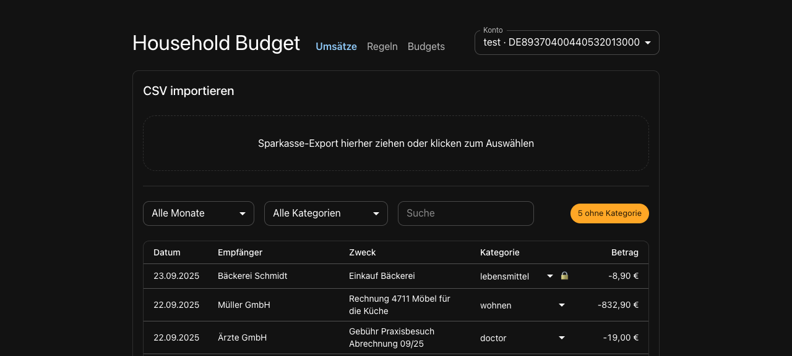
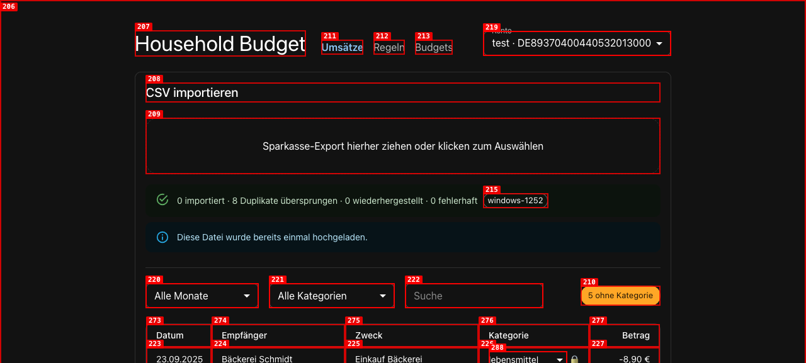
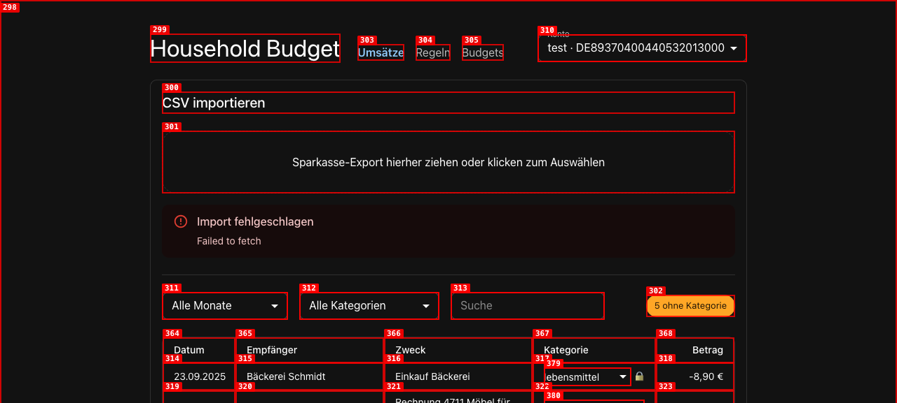
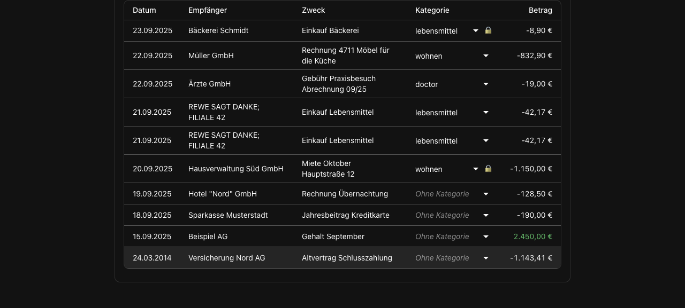
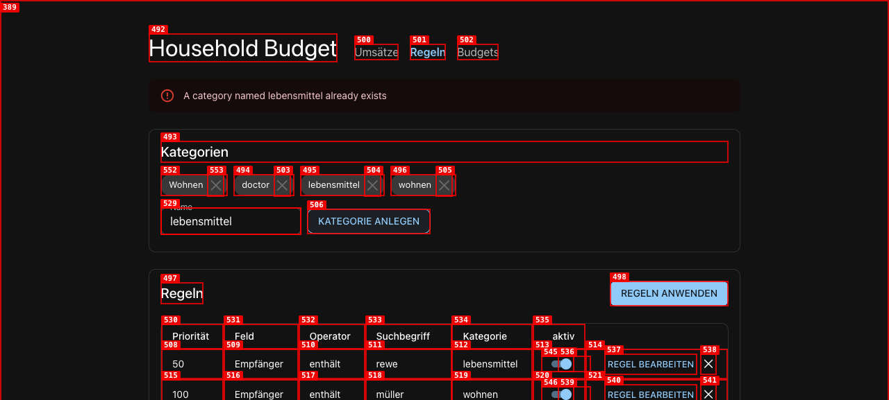
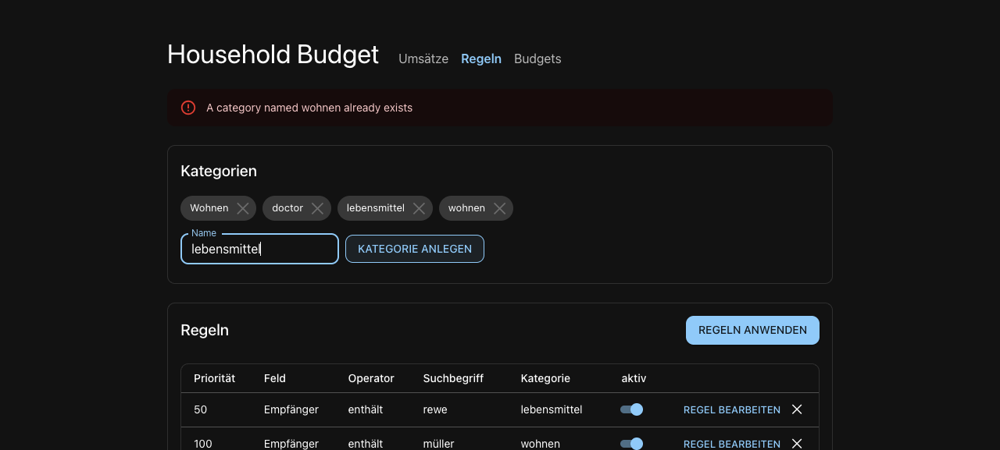
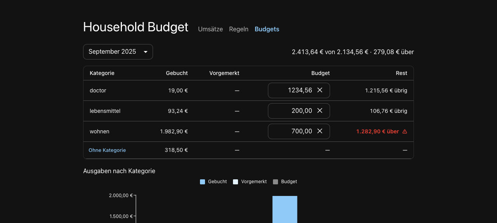
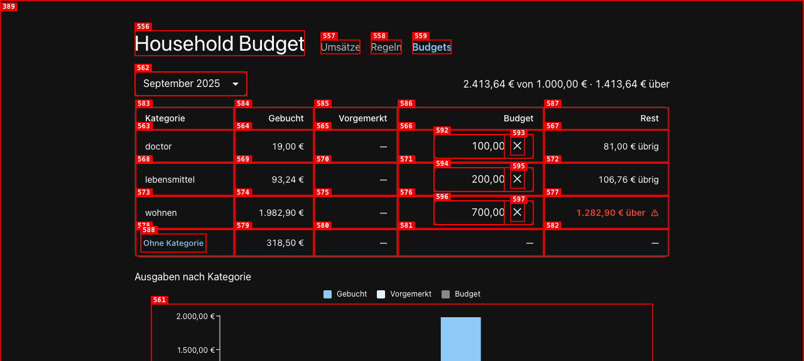
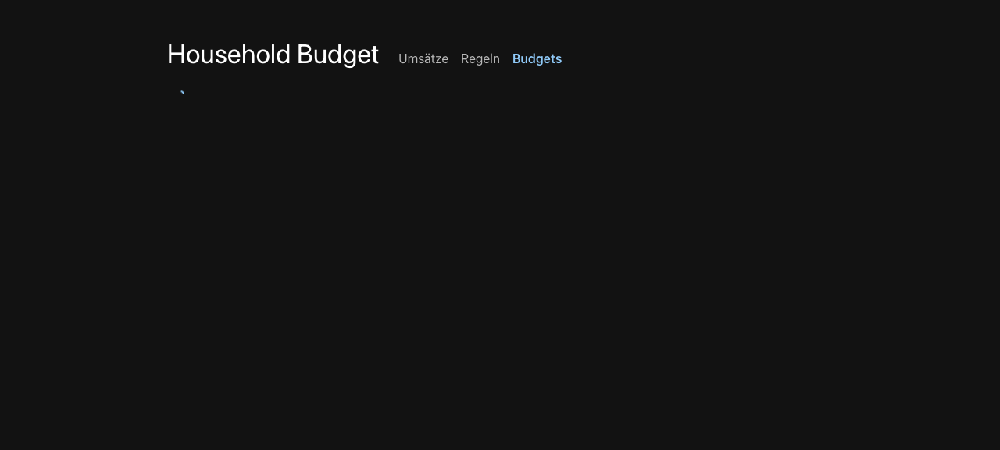
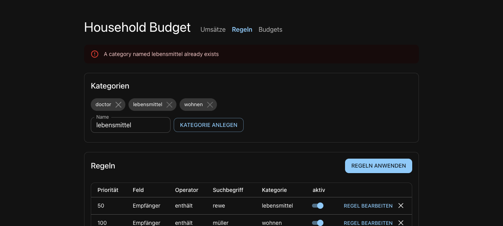

# Dogfood Report: Household Budget

| Field       | Value                                                                                                                                                                    |
| ----------- | ------------------------------------------------------------------------------------------------------------------------------------------------------------------------ |
| **Date**    | 2026-09-23                                                                                                                                                               |
| **App URL** | http://localhost:5173                                                                                                                                                    |
| **Session** | localhost-5173                                                                                                                                                           |
| **Scope**   | Import `fixtures/sparkasse-camt-18.csv` (substituted for the missing `fixtures/dkb.csv`), recategorize a transaction, set budgets, check the monthly report (`/budgets`) |

> Notes: No repro videos, because `ffmpeg` is not installed and `agent-browser record` needs it. Every issue has step screenshots instead.
> The DB already held data (account `test`) before this session.

## Summary

| Severity  | Count  |
| --------- | ------ |
| Critical  | 0      |
| High      | 0      |
| Medium    | 4      |
| Low       | 6      |
| **Total** | **10** |

## Triage & change log

Triaged 2026-09-24. Fixes are planned in [`docs/plans/05-dogfood-fixes.md`](../docs/plans/05-dogfood-fixes.md). When a fix lands, add a dated **Resolution** line under its issue below and update the Status here.

| Issue                                                                     | Decision                                                  | Status                    |
| ------------------------------------------------------------------------- | --------------------------------------------------------- | ------------------------- |
| ISSUE-001 pending row missing from summary                                | Could not reproduce                                       | closed – not reproducible |
| ISSUE-002 raw "Failed to fetch"                                           | Not important; moves to the translation plan              | deferred                  |
| ISSUE-003 chevron misaligned on locked rows                               | Fix (plan 05, phase 1)                                    | fixed (2026-09-24)        |
| ISSUE-004 case-variant category names                                     | Fix, low priority (plan 05, phase 2)                      | fixed (2026-09-24)        |
| ISSUE-005 English API errors                                              | Moves to the separate translation plan                    | deferred                  |
| ISSUE-006 budget field thousands separator                                | Fix (plan 05, phase 1)                                    | fixed (2026-09-24)        |
| ISSUE-007 budgets only for months with bookings                           | Not important                                             | won't fix (for now)       |
| ISSUE-008 headline counts unbudgeted spend                                | Not now                                                   | won't fix (for now)       |
| ISSUE-009 month switch blanks budgets page                                | Fix (plan 05, phase 4)                                    | fixed (2026-09-24)        |
| ISSUE-010 category delete without undo                                    | Fix: undo snackbar (plan 05, phase 3)                     | fixed (2026-09-24)        |
| ISSUE-011 rule delete without undo                                        | Fix: same undo snackbar, exact restore (plan 05, phase 5) | fixed (2026-09-24)        |
| ISSUE-012 in-use refusal alert flickers on repeat click                   | Fix (plan 05, phase 5)                                    | fixed (2026-09-24)        |
| ISSUE-013 (review claim) category delete strands soft-deleted locked rows | Checked in code: does not occur                           | closed – not a bug        |

## Issues

### ISSUE-001: Import summary silently drops a pending ("Umsatz vorgemerkt") row

| Field           | Value                  |
| --------------- | ---------------------- |
| **Severity**    | medium                 |
| **Category**    | functional             |
| **URL**         | http://localhost:5173/ |
| **Repro Video** | N/A (no ffmpeg)        |

**Description**

`sparkasse-camt-18.csv` has 9 data rows. The first import reported `5 importiert · 3 Duplikate übersprungen · 0 wiederhergestellt · 0 fehlerhaft`, which covers 8 rows. Re-importing the same file reports `0 importiert · 8 Duplikate übersprungen …`, again 8. The missing row is line 11: `20.09.25 · Ärzte GmbH · Gebühr Praxisbesuch · -19 · Umsatz vorgemerkt`. It does not appear in the list, and no summary counter includes it. Expected: every input row lands in exactly one bucket, e.g. "1 vorgemerkt übersprungen/ersetzt", so the user can trust that nothing was lost.

**Repro Steps**

1. Open http://localhost:5173 with account `test` selected.
   
2. Drop `fixtures/sparkasse-camt-18.csv` (9 rows) onto the import zone.
3. **Observe:** the counts add up to 8. The pending Ärzte GmbH row from 20.09.2025 is nowhere in the list.
   

---

### ISSUE-002: Network failure during import shows raw English "Failed to fetch"

| Field           | Value                  |
| --------------- | ---------------------- |
| **Severity**    | low                    |
| **Category**    | ux                     |
| **URL**         | http://localhost:5173/ |
| **Repro Video** | N/A (no ffmpeg)        |

**Description**

When the upload request fails at the network level (API stopped, proxy target down, or the selected file became unreadable), the German UI shows `Import fehlgeschlagen` followed by the browser's raw `Failed to fetch`. That message gives no cause and no next step. Expected something like "Server nicht erreichbar – läuft die API?".

**Repro Steps**

1. Open http://localhost:5173 and stop the API, or block `/api/imports`. The screenshot used `agent-browser network route "**/api/imports" --abort`.
   
2. Drop `fixtures/sparkasse-camt-18.csv` onto the import zone.
3. **Observe:** the alert reads "Import fehlgeschlagen / Failed to fetch".
   

---

### ISSUE-003: Dropdown chevron misaligned on hand-locked rows

| Field           | Value                  |
| --------------- | ---------------------- |
| **Severity**    | low                    |
| **Category**    | visual                 |
| **URL**         | http://localhost:5173/ |
| **Repro Video** | N/A                    |

**Description**

In the Kategorie column, rows with a hand-set category (🔒) render the select's chevron about 20px further left than on unlocked rows. The lock icon takes space inside the same cell width, so the chevrons stop lining up vertically down the column. See the Bäckerei Schmidt and Hausverwaltung rows against the others.

**Resolution** (2026-09-24, plan 05): Fixed. The lock slot after the category select now always renders at a fixed 1rem width: empty and `aria-hidden` on unlocked rows, 🔒 with its label on locked rows. The select is the same width on every row, so the chevrons line up. Files: `apps/web/src/pages/CategoryCell.tsx`, `CategoryCell.test.tsx`.

---

### ISSUE-004: Category names that differ only in case are accepted as separate categories

| Field           | Value                       |
| --------------- | --------------------------- |
| **Severity**    | medium                      |
| **Category**    | functional                  |
| **URL**         | http://localhost:5173/rules |
| **Repro Video** | N/A (no ffmpeg)             |

**Description**

Duplicate checking is exact-match only. `wohnen` and `  wohnen  ` are rejected (409), but `Wohnen` is created (201) next to the existing `wohnen`. The category select, the budgets page and the report then show two near-identical categories, and spending splits between them. The app already treats case-folding as important: rules and search match case-insensitively on purpose (per CLAUDE.md). Category uniqueness should do the same.

**Repro Steps**

1. Go to **Regeln**. Category `wohnen` exists.
2. Type `Wohnen` in **Name** and click **KATEGORIE ANLEGEN**.
3. **Observe:** a new chip `Wohnen` appears beside `wohnen`, with no warning. POST `/api/categories` returns 201.
   

**Resolution** (2026-09-24, plan 05): Fixed. `CategoryService.create` and `rename` refuse, with 409, any name equal to another category under core `normalize()`, the fold rules and search use, so `Wohnen`, `WOHNEN` and `wohnen` all collide with `wohnen`. The message names the existing spelling. A rename may change only the case of its own name. No schema change. **Duplicates stored before this fix (e.g. `Test`/`test` in the dev DB) are left untouched. Merge them by hand**: move their rules/transactions/budgets to one, then delete the other. Files: `apps/api/src/rules/category.service.ts`, `category.service.test.ts`.

---

### ISSUE-005: API error messages appear untranslated in the German UI

| Field           | Value                       |
| --------------- | --------------------------- |
| **Severity**    | low                         |
| **Category**    | content                     |
| **URL**         | http://localhost:5173/rules |
| **Repro Video** | N/A                         |

**Description**

The UI is German, but server error text is passed straight through in English. Example: creating an existing category shows the page-level alert `A category named lebensmittel already exists`. The alert also sits at the top of the page, not next to the Name field that caused it. ISSUE-002 shows the same pattern with a browser error.

**Repro Steps**

1. On **Regeln**, type `lebensmittel` (already exists) in **Name**.
   
2. Click **KATEGORIE ANLEGEN**.
3. **Observe:** an English alert appears at the top of the page, away from the field.
   

---

### ISSUE-006: Budget field drops the thousands separator

| Field           | Value                         |
| --------------- | ----------------------------- |
| **Severity**    | low                           |
| **Category**    | content                       |
| **URL**         | http://localhost:5173/budgets |
| **Repro Video** | N/A                           |

**Description**

The budget input accepts `1.234,56` and saves it correctly, but then shows it as `1234,56`. Every other amount on the page, including "Rest" and the headline, uses `1.234,56`.

**Repro Steps**

1. On **Budgets** (September 2025), type `1.234,56` into the `doctor` budget and press Tab.
2. **Observe:** the field shows `1234,56`, while Rest shows `1.215,56 € übrig`.
   

**Resolution** (2026-09-24, plan 05): Fixed. `draftOf` groups whole euros with `Intl.NumberFormat("de-DE")` and appends the cents by hand, so no float is involved. A stored or committed `123456` now shows `1.234,56`, and both `1.234,56` and `1234,56` save `123456`. Files: `apps/web/src/pages/BudgetField.tsx`, `BudgetField.test.tsx`.

---

### ISSUE-007: Budgets can only be set for months that already have transactions

| Field           | Value                         |
| --------------- | ----------------------------- |
| **Severity**    | medium                        |
| **Category**    | ux                            |
| **URL**         | http://localhost:5173/budgets |
| **Repro Video** | N/A                           |

**Description**

The **Monat** picker only lists months that contain transactions: `September 2025` and `März 2014`, the second only because of one stray 2014 booking. You can't pick October 2025 to plan next month's budget before its first import. A budgeting app should let you set limits ahead of spending. There's also no way to carry last month's limits forward.

**Repro Steps**

1. Open **Budgets** and open the **Monat** dropdown.
2. **Observe:** only months with bookings are listed. There's no current or next month and no free month entry.

---

### ISSUE-008: Headline "über" figure counts uncategorized and unbudgeted spend against the budget total

| Field           | Value                         |
| --------------- | ----------------------------- |
| **Severity**    | medium                        |
| **Category**    | ux                            |
| **URL**         | http://localhost:5173/budgets |
| **Repro Video** | N/A                           |

**Description**

For September 2025 the headline reads `2.413,64 € von 1.000,00 € · 1.413,64 € über`. The 2.413,64 € includes the 318,50 € in **Ohne Kategorie**, which by design can never have a limit. It is compared against the sum of the limits only. The overspend within budgeted categories is 1.282,90 € (wohnen), plus 0 for doctor and lebensmittel. The headline, the most prominent number on the page, therefore overstates the overrun. Either compare budgeted spend with budgets, or show unbudgeted spend as a separate figure.

---

### ISSUE-009: Switching month blanks the whole page behind a spinner

| Field           | Value                         |
| --------------- | ----------------------------- |
| **Severity**    | low                           |
| **Category**    | ux                            |
| **URL**         | http://localhost:5173/budgets |
| **Repro Video** | N/A (no ffmpeg)               |

**Description**

Choosing another month in **Monat** unmounts the picker, table and chart and shows only a small spinner in the top-left corner. The page collapses and then jumps back. The API answers in about 2 ms (checked with curl), so the loading state could keep the previous month's content visible, dimmed, until the new data arrives. Wall-clock time from the CLI varied from 0.7 to 8 s. That includes automation latency, so no exact duration is claimed here.

**Repro Steps**

1. On **Budgets**, open **Monat** and pick `März 2014`.
2. **Observe (immediately after):** an empty page with only the header and a spinner.
   

**Resolution** (2026-09-24, plan 05): Fixed. A month switch no longer blanks the page. The spinner shows only on the very first load of transactions. The new month's spending shows at once, from rows already in memory. The Budget and Rest cells show `…` ("Budgets werden geladen") and the headline reads `<booked> ausgegeben` until the limits arrive. Limits are cached per month for the page's lifetime, so returning to a month is instant and makes no second request, and budget writes update the cached month. Files: `apps/web/src/pages/BudgetsPage.tsx`, `BudgetTable.tsx`, `apps/web/src/i18n/budgets.ts`, plus their tests.

**Follow-up** (2026-09-24, review of PR #13): the chart first drew no Budget bars while limits loaded, which read as "no limits set". It now leaves the Budget series out, dims itself, sets `aria-busy`, and adds "Budgets werden geladen" to its caption until the limits arrive. Files: `apps/web/src/pages/SpendingChart.tsx`, `SpendingChart.test.tsx`, `BudgetsPage.tsx`, `BudgetsPage.test.tsx`.

---

### ISSUE-010: Deleting a category takes one click, with no confirmation or undo

| Field           | Value                       |
| --------------- | --------------------------- |
| **Severity**    | low                         |
| **Category**    | ux                          |
| **URL**         | http://localhost:5173/rules |
| **Repro Video** | N/A                         |

**Description**

The ✕ on a category chip deletes it immediately: no dialog, no snackbar, no undo. It sits right next to the chip label, so a misclick is easy. Verified only on an unused test category (`Wohnen`). Deleting an in-use category (with rules, transactions and a budget) wasn't tried, to avoid destroying the existing data. That case deserves a check of what happens to its rules, transactions and budgets.

**Repro Steps**

1. On **Regeln**, create category `Wohnen`, then click the ✕ on its chip.
2. **Observe:** the chip disappears at once. `agent-browser dialog status` reports no dialog.
   

**Resolution** (2026-09-24, plan 05): Fixed with an undo snackbar instead of a confirm dialog. Delete stays one click and immediate. A snackbar then shows `„<name>“ gelöscht · RÜCKGÄNGIG` for 6 s. Undo re-creates the category by name, and nothing is lost because the API already refuses to delete a category any rule, transaction or budget uses. A second delete replaces the snackbar, a click elsewhere does not dismiss it, and a refused (in-use) delete shows no snackbar. Files: `apps/web/src/pages/RulesPage.tsx`, `RulesPage.test.tsx`, `apps/web/src/i18n/rules.ts`, `rules.test.ts`.

---

### ISSUE-011: Deleting a rule takes one click, with no confirmation or undo

| Field           | Value                       |
| --------------- | --------------------------- |
| **Severity**    | medium                      |
| **Category**    | ux                          |
| **URL**         | http://localhost:5173/rules |
| **Repro Video** | N/A                         |

**Description**

Found by the user after the first round of fixes. The ✕ on a rule row deletes it immediately (`deleteRule(rule.id)`). A rule holds more than a category does (field, operator, search term, priority, category), so losing one by misclick costs more. There's also an ordering catch: rules with equal priority are ordered by `createdAt`. A naive re-create would move the rule behind its peers and could change which rule wins.

**Repro Steps**

1. On **Regeln**, click ✕ on any rule.
2. **Observe:** the rule is gone at once, with no way back.

**Resolution** (2026-09-24, plan 05): Fixed. Deleting a rule stays one click and shows `Regel „<Suchbegriff>“ gelöscht · RÜCKGÄNGIG`, in the same single snackbar as category deletes (the latest delete of either kind wins). The restore is exact: `DELETE /api/rules/:id` now answers 200 with the rule including `createdAt` (was 204), and the new `POST /api/rules/restore` re-inserts it with the same id and `createdAt`, so it keeps its place among equal priorities. It returns 409 if restored twice, 404 if the category was deleted meanwhile, and 400 for a malformed body. Files: `packages/core/src/api.ts` (`DeletedRulePayload`), `apps/api/src/rules/rule.service.ts`, `rule.controller.ts`, `apps/web/src/api/client.ts`, `apps/web/src/pages/RulesPage.tsx`, `apps/web/src/i18n/rules.ts`, plus their tests.

---

### ISSUE-012: Clicking ✕ again on an in-use category makes the warning flicker

| Field           | Value                       |
| --------------- | --------------------------- |
| **Severity**    | low                         |
| **Category**    | visual                      |
| **URL**         | http://localhost:5173/rules |
| **Repro Video** | N/A                         |

**Description**

Found by the user. `remove()` cleared the refusal alert _before_ sending the DELETE, and the 409 put it back. A DOM observer showed the alert removed and re-inserted 17 ms apart on every repeat click. Because the alert sits between the chips and the form, the layout jumped twice.

**Repro Steps**

1. On **Regeln**, click ✕ on a category in use (e.g. one with transactions): "Wird noch verwendet: …" appears.
2. Click the same ✕ again.
3. **Observe:** the warning disappears and reappears, and the form below jumps.

**Resolution** (2026-09-24, plan 05): Fixed. The refusal is no longer cleared before the DELETE; it is replaced by the answer (cleared on success, re-set on 409). A repeat click on an in-use category now leaves the same warning node in place, so nothing is removed or re-inserted and nothing jumps. A test confirms it fails against the old code. File: `apps/web/src/pages/RulesPage.tsx`, `RulesPage.test.tsx`.

---

### ISSUE-013: (review claim, not a bug) category delete strands soft-deleted locked rows

**Claim** (code review of PR #13): deleting a category nulls `categoryId` on soft-deleted rows (the optional relation defaults to `SetNull`) but leaves them locked. A re-import restore then brings them back uncategorized and locked, so rules skip them forever, and the category undo cannot re-link them.

**Checked 2026-09-24: does not occur.** The only soft-delete path, `AccountService.softDeleteTransaction` (`apps/api/src/accounts/account.service.ts:183`), writes `{ deletedAt: new Date(), categoryLockedAt: null }`, so a soft-deleted row is never locked. After a category delete and a re-import restore, the row is unlocked and the next apply re-derives its category. The only way to hit it would be a row soft-deleted by hand in the database with its lock left on. No change made. The undo comment in `RulesPage.tsx` now says why it holds.
---

## Scope notes

- **`fixtures/dkb.csv` does not exist,** and the app only supports Sparkasse CSV-CAMT. The session used `fixtures/sparkasse-camt-18.csv` instead.
- **The app has no "dashboard".** The closest thing is `/budgets`, a monthly table plus the "Ausgaben nach Kategorie" chart. That page was treated as the dashboard. Its figures (93,24 / 1.982,90 / 19,00 / 318,50 / 2.413,64) match the transactions exactly.
- **Worked correctly:** re-import dedup (`0 importiert · 8 Duplikate übersprungen` plus the "bereits hochgeladen" notice), manual recategorize (PATCH 200, lock icon, uncategorized count 5 → 4), budget validation (red hint "Betrag in Euro, z. B. 700 oder 700,50" for `abc`, `-50`, `12.5`), and the Ohne Kategorie drill-down from Budgets to the filtered list.
- **Environment:** port 3000 has two listeners, the budget API on `*:3000` and a ThreatSea Vite dev server on `[::1]:3000`. The 5173 proxy reaches the API, but `curl localhost:3000` reaches ThreatSea. That's worth knowing when debugging.
- **Data changed by this session:** imported 5 rows from sparkasse-camt-18. Set the Miete 20.09.2025 row to `wohnen` (now locked). The `doctor` budget for 2025-09 was edited and restored to 100,00. Category `Wohnen` was created and deleted.
